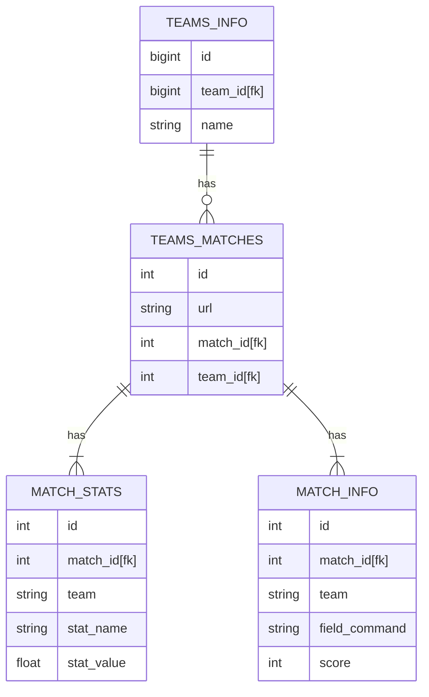
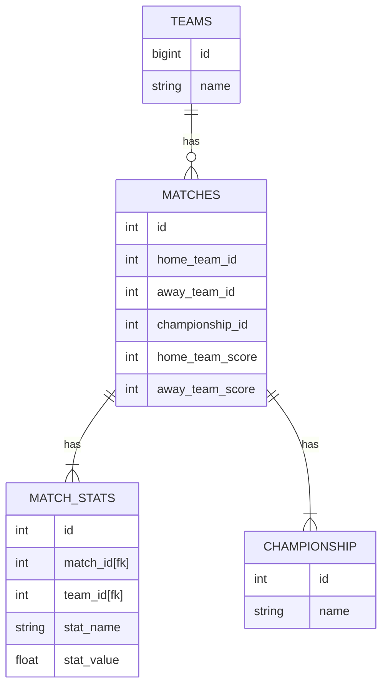

# Scraper para dados do Brasileirão

Esse repositório retira os dados do site `https://espn.com.br` referentes a partidas de futebol jogadas durante o Campeonato Brasileiro Série A (Brasileirão).

# Tecnologias utilizadas
- [Python 3.10](https://www.python.org/)
- [Dagster](https://dagster.io/)
- [PostgreSQL](https://www.postgresql.org/)
- [BeautifulSoup](https://www.crummy.com/software/BeautifulSoup/)

# Database
Vamos utilizar uma database PostGRESQL para guardar os dados que vão ser retirados do site da forma bruta (raw). Após o armazenamento utilizaremos [DBT](https://www.getdbt.com/) para normalizá-los e fazer cálculos para cada data mart.

## Raw

## Normalizada

