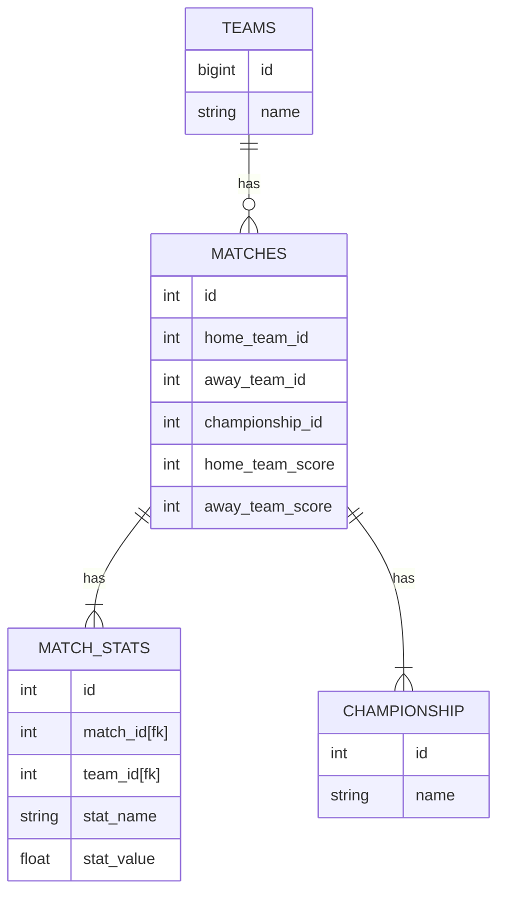

# Scraper para dados de partidas de futebol

# Database

```mermaid
erDiagram
    TEAMS ||--o{ MATCHES : has
    MATCHES ||--|{ MATCH_STATS : has
    MATCHES ||--|{ CHAMPIONSHIP : has
    
    TEAMS {
        bigint id
        string name
    }
    CHAMPIONSHIP {
        int id
        string name
    }
    MATCHES {
        int id
        int home_team_id
        int away_team_id
        int championship_id
        int home_team_score
        int away_team_score
    }
    MATCH_STATS {
        int id
        int match_id[fk]
        int team_id[fk]
        string stat_name
        float stat_value
    }
```
