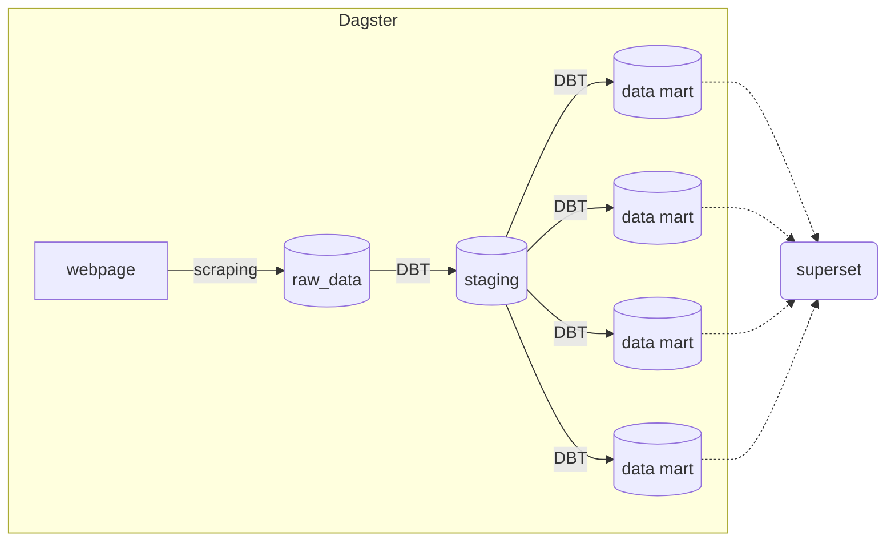
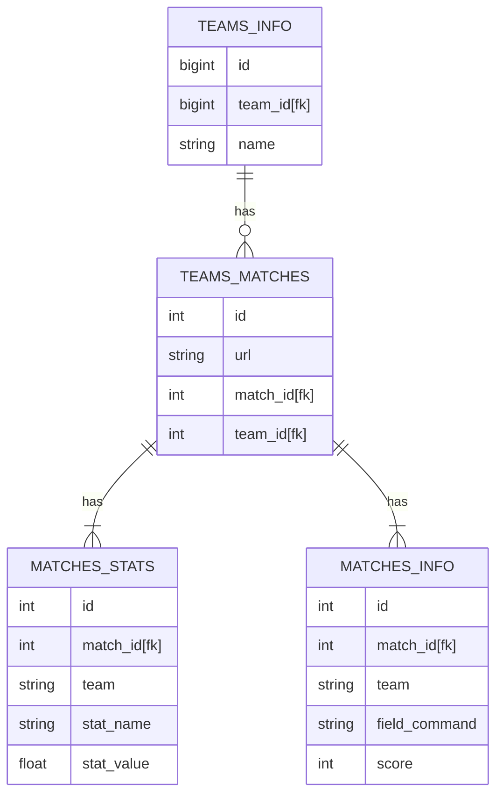
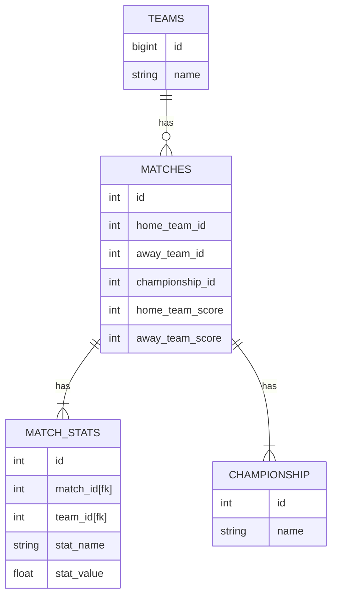
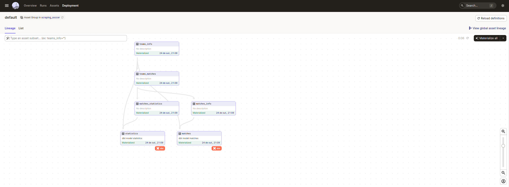

# Scraper para dados do Brasileirão

Esse repositório retira os dados do site `https://espn.com.br` referentes a partidas de futebol jogadas durante o Campeonato Brasileiro Série A (Brasileirão).

# Tecnologias utilizadas

- [Python 3.10](https://www.python.org/)
- [Dagster](https://dagster.io/)
- [PostgreSQL](https://www.postgresql.org/)
- [BeautifulSoup](https://www.crummy.com/software/BeautifulSoup/)
- [DBT](https://www.getdbt.com/)

# Arquitetura

Como estamos trabalhando com um trabalho em lote (batch) a arquitetura é pensada para suprir a necessidade de atualizar os dados em períodos que são maiores do que segundos (nesse caso, a cada dia). Portanto, escolhi utilizar Dagster para orquestrar o webscraping e as transformações que estão implementadas utilizando o DBT, tendo a seguinte arquitetura:

# Database

Vamos utilizar uma database [PostgreSQL](https://www.postgresql.org/) para guardar os dados que vão ser retirados do site da forma bruta (raw). Após o armazenamento utilizaremos [DBT](https://www.getdbt.com/) para normalizá-los, guardar em um schema de staging e fazer cálculos para cada data mart.

## Raw

## Normalizada

## Dagster

